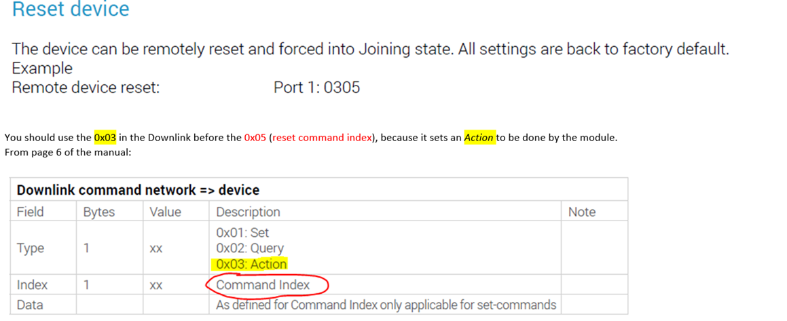

# How-to-Change-NS-Without-Deleting-the-Device

How to change the NS without deleting the device from the previous one?

For some reason, if we want to swap the network server from one application to another. We can manage it by Downlink commands to reset the device and by a new joining request.

In this case, we must delete the device from the NS. But if we delete the device from NS, we will lose control of the device. As like LR3 LoRaWAN water meter module. 
So, how to change the NS? 
By the way, when we send the downlink commands to the device before that we will edit or change the application key from device settings. 
Devise will try to the region again and it will connect with the new NS, not the previous one.

For example,  i try with LR3 LoRaWAN water meter module. To do so, first we need to dismount the module from above the meter. 
Then we need to send the reset command 0305 by Base64 formate. 

🚩 Connect with me on social
- LinkedIn: https://www.linkedin.com/in/ariful-islam-arif-2987b51a3/
- Twitter: https://twitter.com/arifulislam301
- Instagram: https://www.instagram.com/ariful_mr_islam/

🔔 Subscribe to my YouTube channel
https://www.youtube.com/channel/UCED68cm6nHaAlAk0h9I3yAQ
